# jewelry-structure-search 模块文档

## 简介

`web/app.js` 是珠宝图库管理系统的前端核心模块，运行于浏览器端。该模块负责驱动整个单页应用（SPA）的完整交互流程：从应用初始化、图库浏览，到客户图上传、AI 智能识别，以及手动结构标签搜索。所有业务逻辑均通过调用后端 REST API 完成，模块自身专注于界面渲染、用户操作响应与状态管理。

---

## 目录

1. [架构总览](#1-架构总览)
2. [核心组件说明](#2-核心组件说明)
3. [组件依赖关系](#3-组件依赖关系)
4. [数据流与交互流程](#4-数据流与交互流程)
   - 4.1 [应用启动流程](#41-应用启动流程)
   - 4.2 [图片上传与预处理流程](#42-图片上传与预处理流程)
   - 4.3 [AI 自动识别搜索流程](#43-ai-自动识别搜索流程)
   - 4.4 [手动结构标签搜索流程](#44-手动结构标签搜索流程)
   - 4.5 [关键词搜索流程](#45-关键词搜索流程)
   - 4.6 [扫描图库流程](#46-扫描图库流程)
5. [DOM 元素与模块状态](#5-dom-元素与模块状态)
6. [后端 API 接口一览](#6-后端-api-接口一览)
7. [图片标签数据结构](#7-图片标签数据结构)
8. [错误处理策略](#8-错误处理策略)

---

## 1. 架构总览

`web/app.js` 采用轻量级原生 JavaScript（无框架）实现，直接操作 DOM，通过 `fetch` 调用后端 HTTP API，构成一个典型的「Browser → REST API → 后端服务」三层架构。

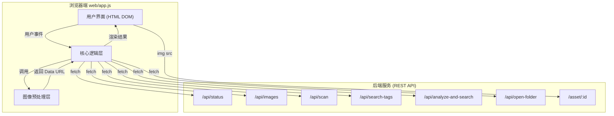

---

## 2. 核心组件说明

模块由 8 个核心函数组成，按职责分为三个层次：**基础工具层**、**图像处理层**、**业务逻辑层**。

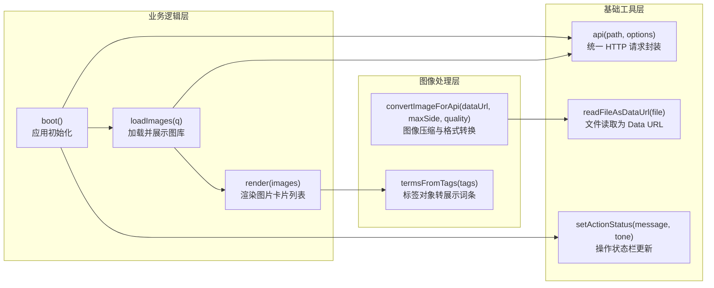

### 2.1 `api(path, options)` — 统一 HTTP 请求封装

**职责**：对 `fetch` 进行封装，统一处理 JSON 解析与 HTTP 错误。

```
async function api(path, options)
  → fetch(path, options)
  → 解析 JSON
  → !response.ok 时抛出 Error(data.error)
  → 返回 data
```

| 参数 | 类型 | 说明 |
|------|------|------|
| `path` | `string` | 请求路径，如 `/api/status` |
| `options` | `RequestInit?` | 标准 `fetch` 选项（method、headers、body 等） |

所有业务函数的网络请求均通过此函数路由，确保错误处理行为一致。

---

### 2.2 `setActionStatus(message, tone)` — 操作状态栏更新

**职责**：更新 `#actionStatus` 元素的文本内容与样式类，以视觉方式反馈操作进度或结果。

| `tone` 值 | 视觉语义 | 典型场景 |
|-----------|---------|---------|
| `""`（默认）| 中性提示 | 进行中的操作说明 |
| `"success"` | 成功（绿色） | 操作完成 |
| `"error"` | 错误（红色） | 异常或校验失败 |

---

### 2.3 `readFileAsDataUrl(file)` — 文件读取为 Data URL

**职责**：将 `File` 对象（来自 `<input type="file">`）异步读取为 Base64 Data URL，供后续图像处理使用。

```
File → FileReader.readAsDataURL() → Promise<string (Data URL)>
```

---

### 2.4 `convertImageForApi(dataUrl, maxSide, quality)` — 图像压缩与格式转换

**职责**：将任意图像等比例缩放至指定最大边长，并重新编码为 JPEG，以减小发送至后端 API 的数据体积。

| 参数 | 默认值 | 说明 |
|------|--------|------|
| `dataUrl` | — | 原始图像 Data URL |
| `maxSide` | `1600` | 图像最长边的像素上限 |
| `quality` | `0.82` | JPEG 压缩质量（0-1） |

**处理步骤**：

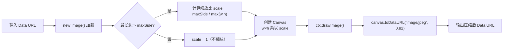

---

### 2.5 `termsFromTags(tags)` — 标签对象转展示词条

**职责**：将后端返回的结构化标签对象扁平化为有序词条数组，供卡片 chip 渲染使用。过滤掉空值与 `"unclear"` 占位值，最多取 8 个词条。

**标签提取优先级**（依次展开）：

```
category → stone_shape → settings[] → band_types[] → structures[] → styles[]
```

```javascript
// 输入示例
{
  category: "ring",
  stone_shape: "round",
  settings: ["prong"],
  band_types: ["plain"],
  structures: [],
  styles: ["vintage"]
}
// 输出示例
["ring", "round", "prong", "plain", "vintage"]
```

---

### 2.6 `render(images)` — 渲染图片卡片列表

**职责**：将图片数据数组转换为 HTML 卡片列表并注入 `#grid`，同时更新计数显示。

每张卡片包含以下内容：

| 元素 | 数据来源 | 说明 |
|------|----------|------|
| `` | `/asset/${image.id}` | 懒加载缩略图 |
| `.name` | `image.file_name` | 文件名 |
| `.meta`（目录）| `image.folder` | 所在文件夹 |
| `.meta`（分数）| `image.score` | 结构评分（可选） |
| `.chips` | `termsFromTags(image.tags)` | 结构标签 chip |
| `.openBtn` | `image.id` | 打开文件所在位置按钮 |

---

### 2.7 `loadImages(q)` — 加载并展示图库

**职责**：携带可选关键词参数请求 `/api/images`，获取图片列表后调用 `render()` 渲染。

```
loadImages(q) → GET /api/images?limit=80&q={q} → render(data.images)
```

---

### 2.8 `boot()` — 应用初始化

**职责**：应用入口函数，页面加载时自动执行。负责拉取系统状态、初始化界面显示、填充配置项并触发初始图库加载。

```
boot()
  → GET /api/status
  → 更新 statusEl（图库统计）
  → 更新 scanRoot.value（默认扫描目录）
  → 更新 apiNote（OpenAI Key 检测提示）
  → 若无已打标签图片 → setActionStatus 提示
  → loadImages()  ← 加载初始图库
```

---

## 3. 组件依赖关系

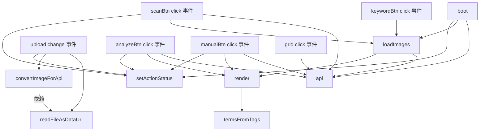

---

## 4. 数据流与交互流程

### 4.1 应用启动流程

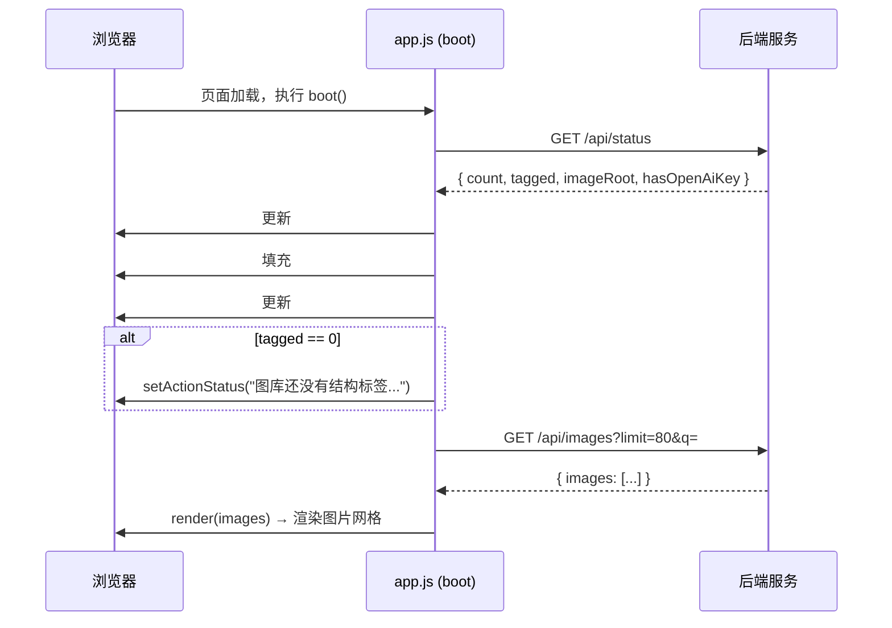

---

### 4.2 图片上传与预处理流程

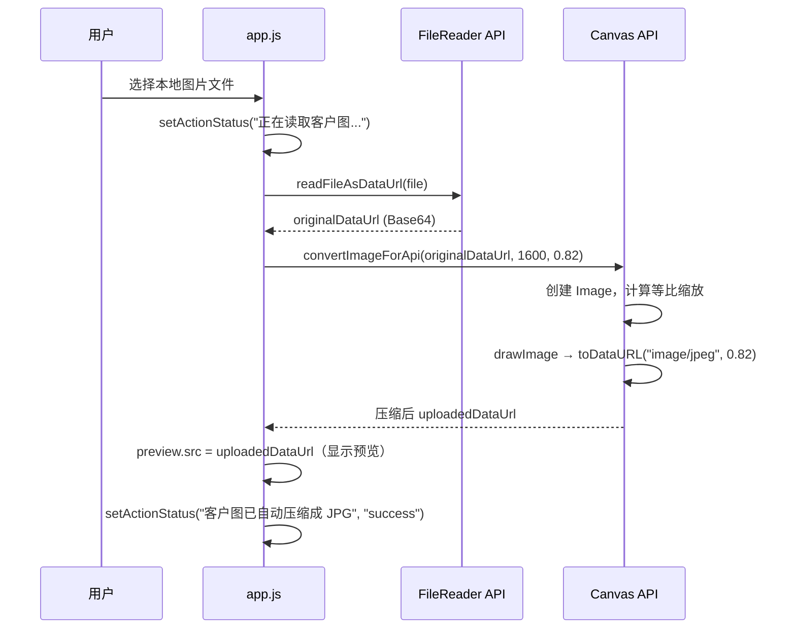

---

### 4.3 AI 自动识别搜索流程

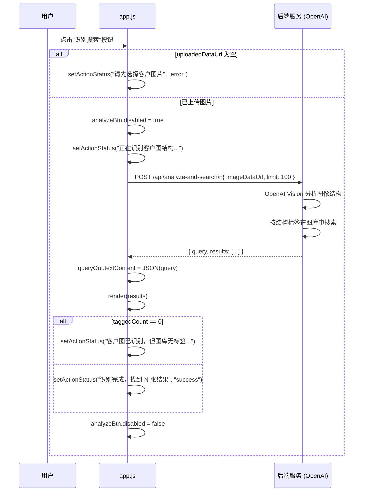

---

### 4.4 手动结构标签搜索流程

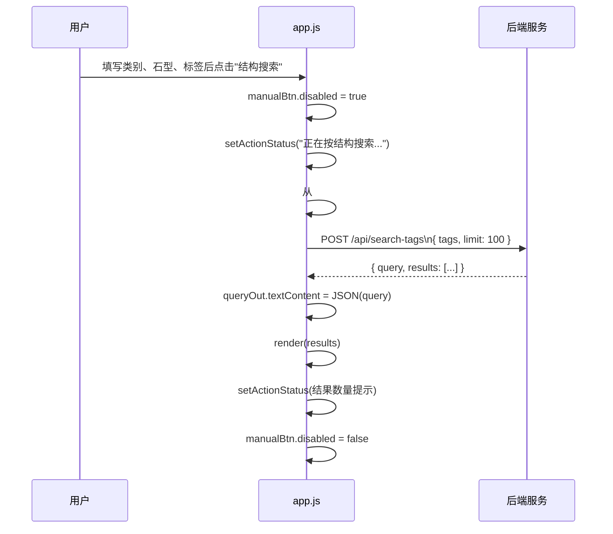

**tags 对象构建逻辑**：

```javascript
{
  category:        #category.value  || "unclear",
  stone_shape:     #stone.value     || "unclear",
  settings:        extraTags,   // 来自 #tags 逗号分隔输入
  band_types:      extraTags,
  structures:      extraTags,
  styles:          [],
  reuse_keywords:  extraTags
}
```

---

### 4.5 关键词搜索流程

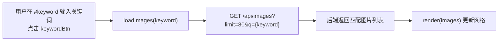

---

### 4.6 扫描图库流程

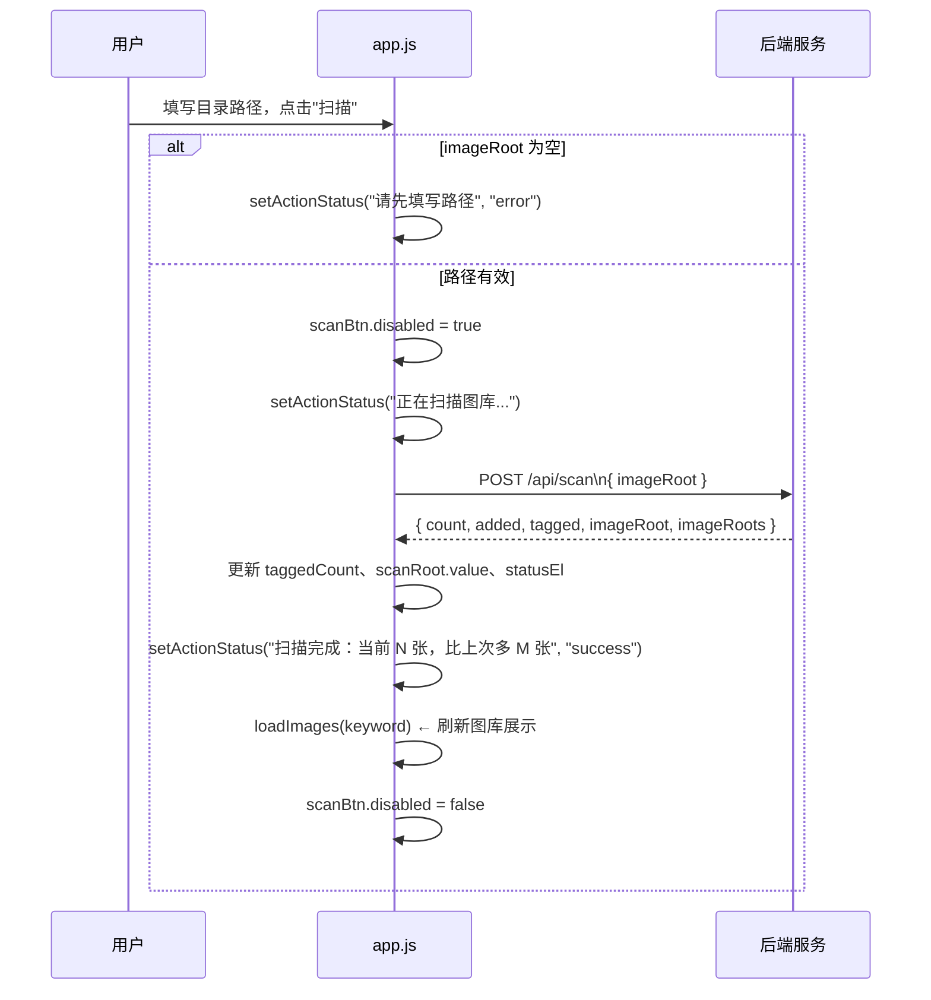

---

## 5. DOM 元素与模块状态

### 5.1 DOM 元素映射

模块在初始化时通过 `document.querySelector` 绑定以下 DOM 元素：

| 变量名 | 选择器 | 用途 |
|--------|--------|------|
| `grid` | `#grid` | 图片卡片网格容器 |
| `statusEl` | `#status` | 图库统计信息文本 |
| `countEl` | `#count` | 当前展示图片数量 |
| `queryOut` | `#queryOut` | 调试用查询条件 JSON 展示 |
| `upload` | `#upload` | 图片文件上传输入框 |
| `preview` | `#preview` | 上传图片预览 `` |
| `apiNote` | `#apiNote` | OpenAI API Key 检测提示 |
| `actionStatus` | `#actionStatus` | 操作状态反馈区域 |
| `analyzeBtn` | `#analyzeBtn` | AI 识别搜索按钮 |
| `manualBtn` | `#manualBtn` | 手动结构搜索按钮 |
| `scanBtn` | `#scanBtn` | 扫描图库按钮 |
| `scanRoot` | `#scanRoot` | 扫描路径输入框 |

### 5.2 模块级状态变量

| 变量名 | 类型 | 初始值 | 说明 |
|--------|------|--------|------|
| `uploadedDataUrl` | `string` | `""` | 当前上传并压缩后的图片 Data URL |
| `taggedCount` | `number` | `0` | 图库中已打结构标签的图片总数 |

`taggedCount` 影响 AI 识别搜索后的状态提示逻辑：若为 0，则提示用户先运行打标签命令。

---

## 6. 后端 API 接口一览

所有请求均由 `api()` 函数封装发出，统一处理错误。

| 接口 | 方法 | 请求体 | 响应字段 | 模块用途 |
|------|------|--------|----------|---------|
| `/api/status` | GET | — | `count, tagged, imageRoot, hasOpenAiKey` | 应用初始化 |
| `/api/images` | GET | `?limit=80&q=` | `images[]` | 图库浏览 / 关键词搜索 |
| `/api/scan` | POST | `{ imageRoot }` | `count, added, tagged, imageRoot, imageRoots[]` | 扫描图库目录 |
| `/api/search-tags` | POST | `{ tags, limit }` | `query, results[]` | 手动结构标签搜索 |
| `/api/analyze-and-search` | POST | `{ imageDataUrl, limit }` | `query, results[]` | AI 识别 + 结构搜索 |
| `/api/open-folder` | POST | `{ id }` | — | 在系统文件管理器中打开文件位置 |
| `/asset/:id` | GET | — | 图片二进制流 | 卡片缩略图加载 |

---

## 7. 图片标签数据结构

后端返回的 `image` 对象结构如下，`termsFromTags()` 与 `render()` 依赖此结构：

```javascript
{
  id:        "string",   // 图片唯一标识，同时作为资源路径
  file_name: "string",   // 文件名
  folder:    "string",   // 所在文件夹路径
  score:     number,     // 结构评分（可选，来自打标签流程）
  tags: {
    category:    "string",    // 珠宝类型，如 "ring" / "necklace"
    stone_shape: "string",    // 宝石形状，如 "round" / "oval"
    settings:    ["string"],  // 镶嵌方式，如 ["prong", "bezel"]
    band_types:  ["string"],  // 戒臂类型，如 ["plain", "split"]
    structures:  ["string"],  // 结构特征，如 ["solitaire", "halo"]
    styles:      ["string"]   // 风格，如 ["vintage", "modern"]
  }
}
```

`termsFromTags()` 从 `tags` 中按优先级提取至多 8 个有效词条（过滤 `null`、空字符串与 `"unclear"`），渲染为 `.chip` 标签。

---

## 8. 错误处理策略

模块采用**分层错误处理**机制，确保异常不会导致页面崩溃：

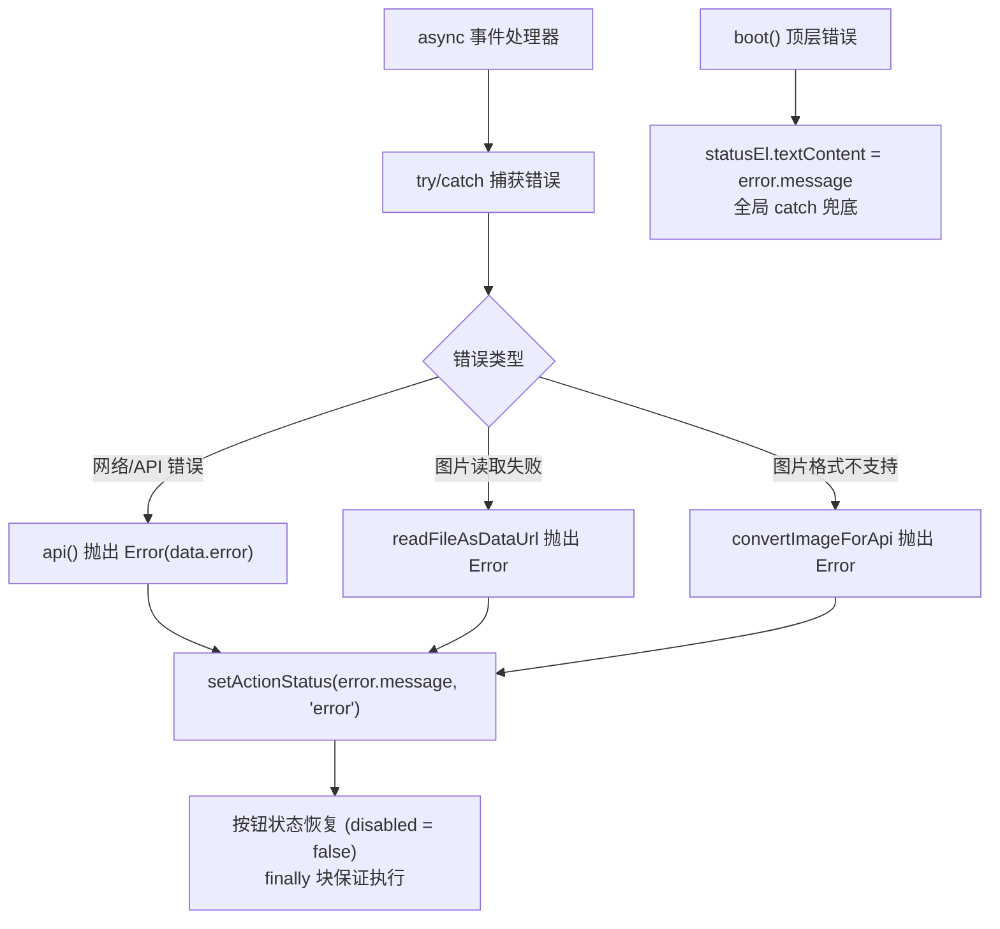

| 错误场景 | 处理方式 | 用户反馈 |
|----------|----------|---------|
| 网络请求失败或后端返回错误 | `api()` 抛出 Error，外层 catch 捕获 | `setActionStatus(message, "error")` |
| 图片读取失败 | `readFileAsDataUrl` reject | 清除预览，显示错误提示 |
| 图片格式不支持 | `convertImageForApi` reject | 提示转为 JPG/PNG |
| 未选择图片即点击识别 | 提前校验 | `setActionStatus("请先选择客户图片", "error")` |
| 未填写路径即点击扫描 | 提前校验 | `setActionStatus("请先填写路径", "error")` |
| `boot()` 初始化失败 | 顶层 `.catch()` | `statusEl` 显示错误信息 |
